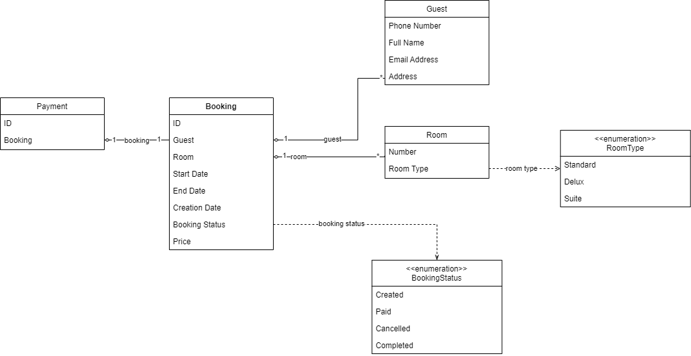

## Class Diagram
Class diagram describes main entites of the application

## ERD
Describes relationships between entities

## Booking state machine
Diagram describing state changes of a booking based on its lifetime and user actions
Class diagram describes main entites of the application
